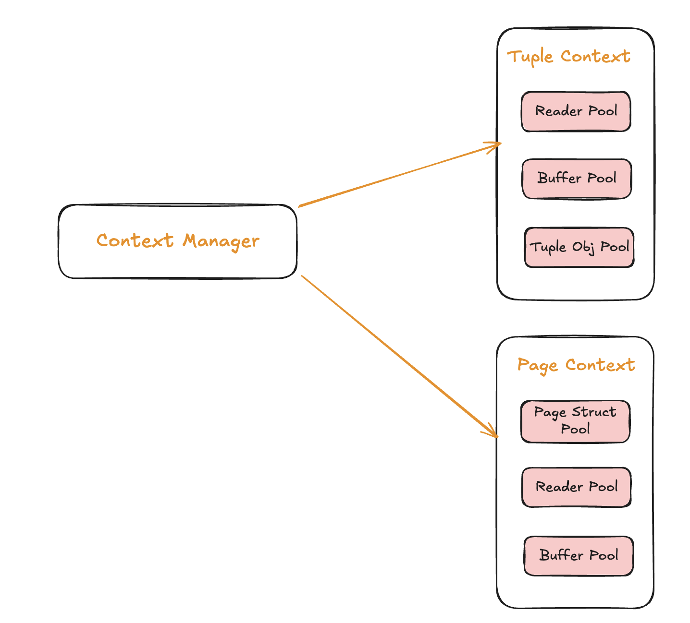

# Memora

[](https://pkg.go.dev/github.com/AlexsanderHamir/Memora)
[](https://goreportcard.com/report/github.com/AlexsanderHamir/Memora)
[](LICENSE)

Memora is a lightweight manager for correlated object pools. It provides context-based grouping and cleanup for multiple pools used together (e.g., row + buffer).



## Features

* Group pools under named contexts
* Thread-safe
* Generic type support
* Custom allocators and cleaners

## Install

```bash
go get github.com/AlexsanderHamir/Memora
```

## Example

```go
import (
	"github.com/AlexsanderHamir/Memora/memcontext"
	"github.com/AlexsanderHamir/PoolX/pool"
)

cm := memcontext.NewContextManager()
ctx := cm.CreateContext("myContext")

config, err := pool.NewPoolConfigBuilder().Build()
if err != nil {
	panic(err)
}

p, err := memcontext.CreatePool(ctx, config, allocator, cleaner)
obj, err := p.Get()
// use obj...
p.Put(obj)
```

## ContextManager Methods

```go
type ContextManager interface {
	CreateContext(name string) *DefaultContext
	GetContext(name string) (*DefaultContext, error)
	GetOrCreateContext(name string) (*DefaultContext, error)
	DeleteContext(name string)
	DeleteAllContexts()
}
```

## Context Pool Methods

```go
func CreatePool[T any](ctx *DefaultContext, cfg *pool.PoolConfig, alloc func() T, clean func(T)) (*pool.Pool[T], error)
func GetPool[T any](ctx *DefaultContext) (*pool.Pool[T], error)
func GetOrCreatePool[T any](ctx *DefaultContext, cfg *pool.PoolConfig, alloc func() T, clean func(T)) (*pool.Pool[T], error)
func DeletePool[T any](ctx *DefaultContext)
func ClosePools(ctx *DefaultContext)
```

## Contributing

I built only what I needed. PRs for additional features or optimizations are welcome.

## License

MIT — see [LICENSE](LICENSE).

